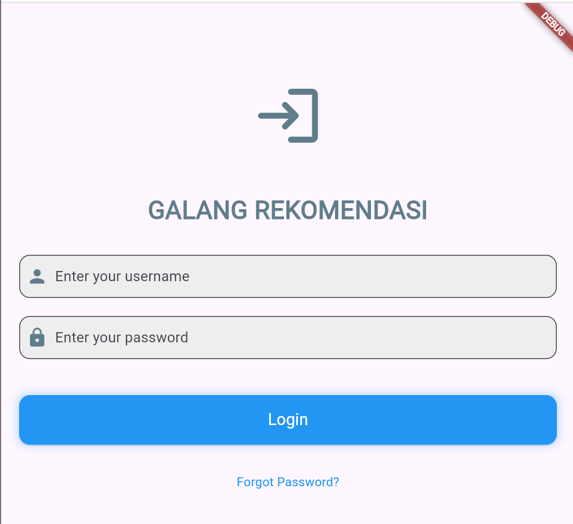
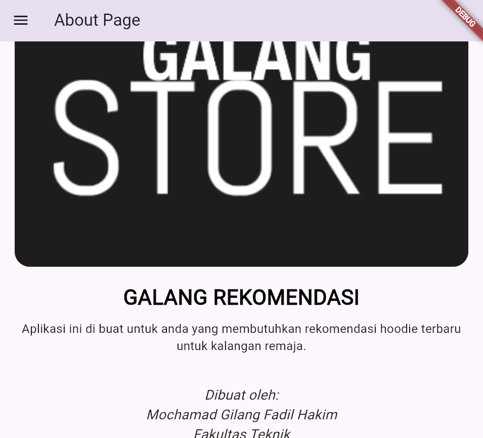
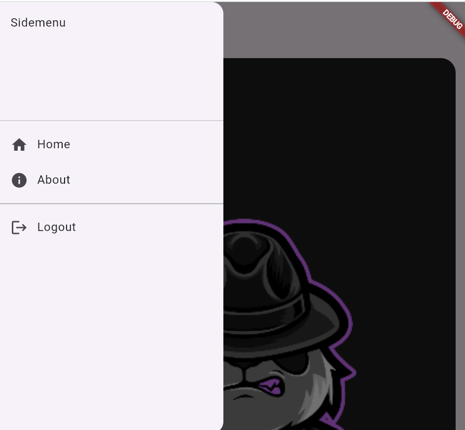

# Tugas Pertemuan 2

Nama : Mochamad Gilang Fadil Hakim

NIM : H1D022082

Shift Lama : B

Shift Baru : B

# PENJELASAN SINGKAT

- Login page : implementasi halaman login menggunakan Flutter dengan stateful widget. Terdapat dua TextEditingController yang digunakan untuk mengontrol input username dan password. Fungsi _saveUsername() menyimpan username yang dimasukkan ke dalam SharedPreferences untuk menyimpan data lokal secara permanen. Fungsi _showInput() digunakan untuk menampilkan input field dengan ikon untuk username dan password, sementara _showDialog() digunakan untuk menampilkan dialog ketika login berhasil atau gagal. Saat tombol login ditekan, jika username dan password sesuai (dalam hal ini hardcoded menjadi 'galang' untuk keduanya), aplikasi menyimpan username dan mengarahkan pengguna ke halaman HomePage(). Jika gagal, dialog error akan muncul. Terdapat juga tombol "Forgot Password?" sebagai placeholder untuk fitur reset password di masa mendatang. Desain tombol dan input field menggunakan BoxDecoration dan ElevatedButton untuk memberikan tampilan modern dengan bayangan dan sudut melengkung.

- Home page  : implementasi halaman utama aplikasi yang menampilkan rekomendasi hoodie menggunakan Flutter dengan StatefulWidget. Pada halaman ini, nama pengguna diambil dari SharedPreferences dan ditampilkan menggunakan metode initState untuk memuat nama pengguna setelah login. Aplikasi menampilkan dua bagian utama, yaitu "Trending Hoodie" dalam bentuk horizontal scrolling list dan "Rekomendasi Hoodie" dalam bentuk grid. Keduanya menggunakan widget ListView.builder dan GridView.builder untuk menampilkan daftar hoodie yang diambil dari sebuah list data. Setiap item dalam daftar ditampilkan dengan gambar dan judul produk yang diposisikan menggunakan BoxDecoration dan DecorationImage. Ketika pengguna mengetuk salah satu hoodie, sebuah dialog detail akan muncul menampilkan judul produk dan harga dengan opsi untuk membeli atau membatalkan.

- About page : implementasi halaman "About Page" dari aplikasi Flutter yang menampilkan informasi tentang aplikasi dan pembuatnya. Halaman ini dibangun menggunakan widget Scaffold yang terdiri dari AppBar sebagai judul halaman dan ListView sebagai konten utama. Di dalam ListView, terdapat beberapa elemen seperti gambar header yang ditampilkan menggunakan Container dengan dekorasi gambar berbentuk kotak (image), judul aplikasi yang dicetak tebal dan besar, deskripsi singkat mengenai aplikasi, dan perkenalan pembuat aplikasi beserta fakultasnya yang ditampilkan dalam gaya teks miring (italic). Gambar ditampilkan secara penuh di bagian atas halaman dengan properti fit: BoxFit.cover, yang memastikan gambar memenuhi seluruh area kotak yang disediakan.

- mendefinisikan sebuah widget bernama Sidemenu, yang merupakan elemen menu samping dalam aplikasi Flutter. Widget ini dibuat menggunakan kelas Drawer, yang menampilkan daftar opsi yang dapat dipilih oleh pengguna, seperti navigasi ke halaman Home dan About. Pada bagian ListTile pertama dan kedua, kode mengatur aksi navigasi ke halaman HomePage dan AboutPage menggunakan Navigator.push, yang mendorong halaman baru ke tumpukan navigasi. Terdapat juga fitur Logout yang menghapus data pengguna dari shared preferences menggunakan SharedPreferences untuk menghapus status login dan mengarahkan pengguna kembali ke halaman login dengan Navigator.of(context).pushReplacementNamed('/login'). Selain itu, kode ini menampilkan sebuah Divider sebagai pembatas visual antara daftar menu utama dan opsi logout.

## HASIL

